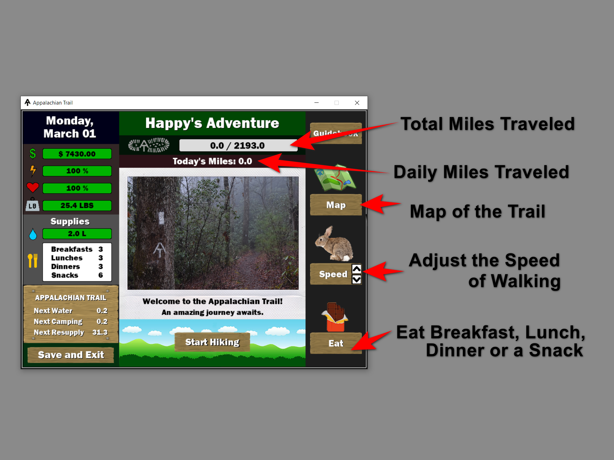

# Appalachian Trail - Thru Hike Game

Pygame - The Appalachian Trail Game is an adventure-based game on the 2,193-mile-long footpath in the eastern United States extending between Springer Mountain in Georgia and Mount Katahdin in Maine.  A thru- hiker is a person who attempts to hike the entire trail in a single season carrying only a backpack and supplies.  A thru-hiker must make stops along the way in towns to replenish supplies and allow the body to recover. 

## Execute Game
Run the main.py file in the Source_code folder

## Game Features
During the game, the player will face obstacles such as:
* Weather
* Wildlife
* Injury
* Sickness
* Gear Damage

During the game, the player will be able to control:
* The distance walked each day
* The amount of food consumed
* Refill water to maintain health and energy levels

The player must reach Mount Katahdin before October 15 when Mount Katahdin closes for the year.

Before leaving for the trail, the player must choose a trail name, starting gear, starting date, available funds, food supplies and water amount.

## Game Introduction

## Game Trailer

## Game Screenshots

## Game Images
All photos used in the game play taken by Mickie Blair
